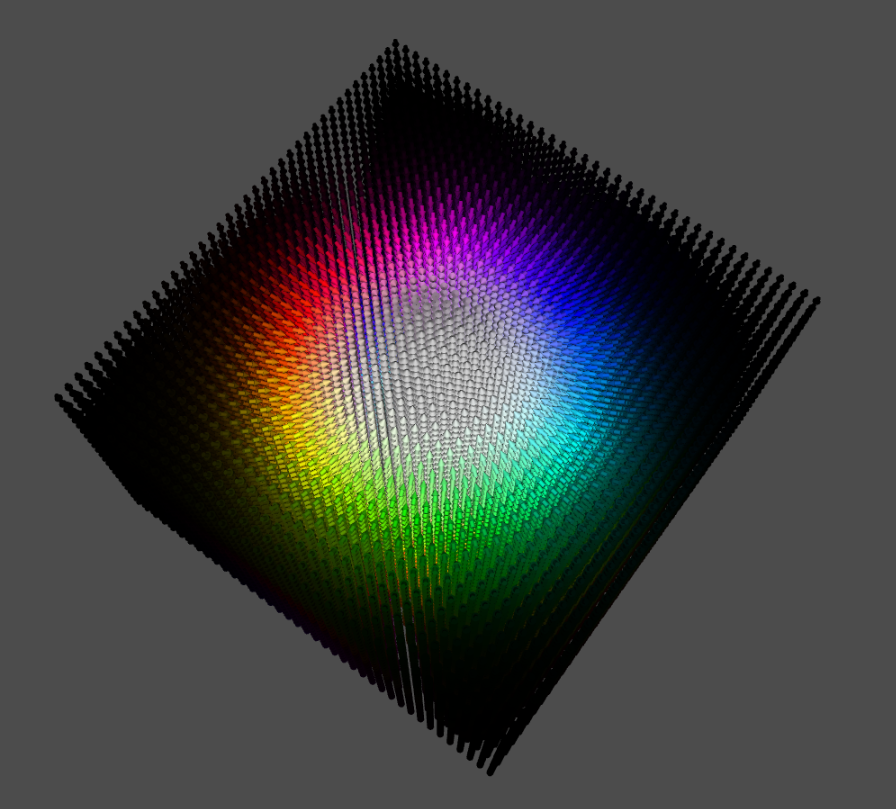
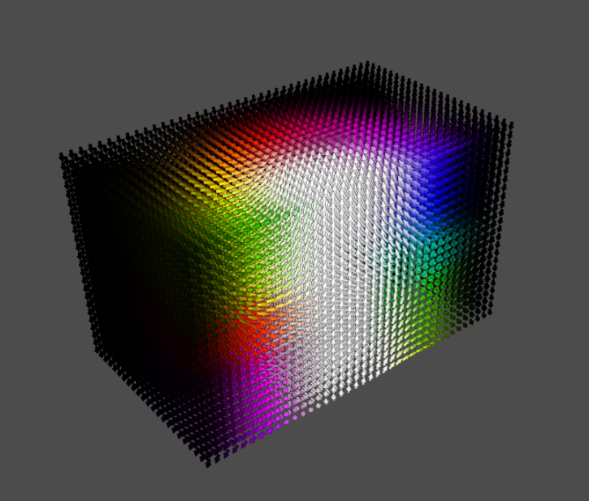
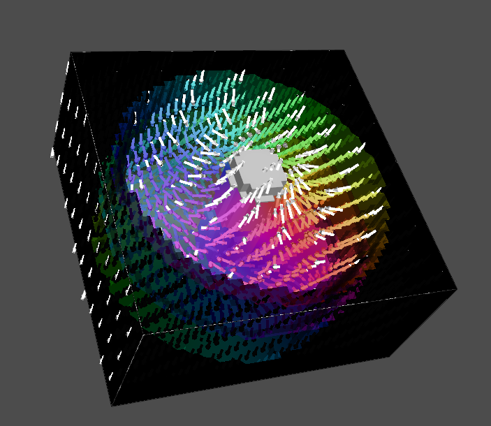
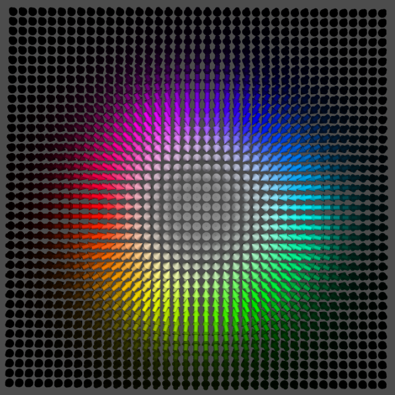
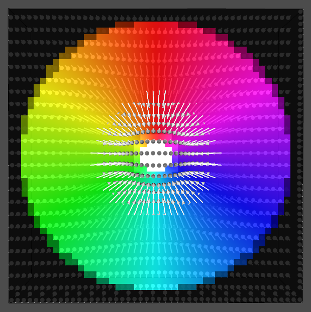

# Final Project Submission
## CS410 Science Visualization, Spring 2026 with Hank Childs
## Created by Melanie Wiegand
## 06/10/2026

### OVERVIEW
For this project, I wanted to take the 3D models that I use for my physics research lab and convert them into something that would work in the VisIt software.

In my research, I model the process of imaging magnetic materials with electron probes, effectively simulating a scanning transmission electron microscope.
To do this, I use MATLAB code along with the MuMax3 software to create 3D models of magnetic skyrmions (nanoscale, whirlpool-like magnetic fields in ferromagnets)

### WHAT I AM SCIENTIFICALLY VISUALIZING
This model is of a hybrid skyrmion, which consists of several layers of "Bloch-type" (whirlpool) behavior, with "Neel caps" on the top and bottom, where the magnetic field becomes a radial gradient from +z in the center to -z outside the radius of the skyrmion. Check out the MuMax figures!

### PROCESS
My code is configured to output OVF files, so the first step was to figure out how to convert these into a format readable by VisIt. 

-> Luckily, Mumax has a convert feature that automatically converts OVF to VTS! easy

**JUST KIDDING**

Here's what the vis software I'm used to looks like:

-> fun fact! VisIt has no native way (to my and various genAI's knowledge) of representing vector direction by color
 - this is the single most important aspect of effectively visualizing azimuthal magnetic fields
 - having only the m vector is not sufficient for me to do any real visualization

-> I tried to bypass this by calculating the angle for each point using arctan(y/x), and then making a pseudocolor of this value
 - ugly branch cut between pi & -pi, plus VisIt doesn't have HSV as a colormap for some reason and all the other cyclic maps have white in them (so there's no good way to visualize the z component)

-> ok, let's just create the colormap in MATLAB and pass it into the OVF as a variable!

**I SPENT SO LONG ON THIS**

*btw there's also no way to color a vector field with a variable at all!! aside from the magnitude of the same variable that I made the field from :DDD but I didn't find that out until later*

-> OVF files do not support more than one variable per coordinate point

-> I also have my code set to output a csv of the same data, let's try converting that to VTS?
 - I genuinely spent like five hours doing this (I didn't write the original MATLAB code and it's 2000 lines and indecipherable)
 - apparently the way that the csv was set up to store data (it was doing some kind of inscrutable multidimensional flattening) was fundamentally incompatible with visit
 - I kept getting indexing errors no matter what
 - gallons of water were spent on these f**** AI chat logs

-> I finally realized I could convert the original OVF (just the m field) into VTS first and THEN append new variables to it
 - this also took me forever
 
-> At last I was able to colormap to HSV in MATLAB, then append the R, G, & B values as scalar variables to my VTS file, then reassemble them into a vector in VisIt.
 - this still only worked for the xy component of direction, and didn't make sense as an actual vector field
 - BUT I can make a truecolor now!! that actually represents the mag field correctly.

 -> I ended up making a few slices to show the field at 10%, 50%, and 90% of the z depth. I also used thresholds of the z component of the mag field to demonstrate the +1 in the middle and -1 on the outside (and truncated the internal truecolor to fill the section in between)
 - I think this actually looks pretty good considering how much I had to fight for it:

-> from there, I did a LOT of tedious keyframe animation, ended up with around 18s of video.

## WHAT I LEARNED

- file conversion is not for the faint of heart
- I probably should have started earlier or gave up sooner or something
- It may be a poor choice for magnetic fields specifically, but VisIt does have a lot more functionality for broad visualization than MuMax (basically everything except directional coloring)
- I wish the UI was a little more customizable; if there's a way to make the plots window bigger, I did not find it

I'm very happy with my results though; here's a MuMax plan view vs. one from my VisIt program:

## SUBMISSION MATERIALS

* README.md
* final_movie_skyrmion.mp4 - my final video
* m_field_augmented_hsv.vts - the dataset that finally worked for getting directional color
* various pngs of what I was trying to emulate & what I ended up with
 